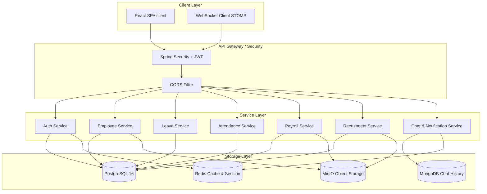

# HRMPro - Enterprise Human Resource Management System

[](https://www.oracle.com/java/)
[](https://spring.io/projects/spring-boot)
[](https://react.dev/)
[](https://playwright.dev/)
[](LICENSE)

**HRMPro** là hệ thống quản trị nhân sự (Human Resource Management) cấp doanh nghiệp (Enterprise-grade), được thiết kế và phát triển bởi **Nguyễn Tấn Thái Dương (Software Engineer)**. Dự án được xây dựng với mục tiêu cung cấp một giải pháp quản lý nhân lực toàn diện, tối ưu hiệu suất và bảo mật thông tin, áp dụng các chuẩn kiến trúc phần mềm hiện đại và quy trình kiểm thử tự động nghiêm ngặt nhất.

Hệ thống tích hợp đầy đủ các tính năng từ quản lý hồ sơ nhân sự, cơ cấu tổ chức phòng ban, quy trình tuyển dụng Kanban, chấm công thời gian thực, duyệt nghỉ phép tự động, tính lương lũy tiến (thuế TNCN & bảo hiểm bắt buộc theo luật Việt Nam), đến hệ thống chat nội bộ thời gian thực và đánh giá hiệu suất 360 độ.

---

## 👨‍💻 Thông Tin Tác Giả

*   **Họ và tên**: Nguyễn Tấn Thái Dương
*   **Chức danh**: Software Engineer / Fullstack Developer
*   **Email**: [thaiduong.nguyen.se@gmail.com](mailto:thaiduong.nguyen.se@gmail.com) *(hoặc email cá nhân của bạn)*
*   **LinkedIn**: [linkedin.com/in/duonggb](https://linkedin.com/in/duonggb) *(Thay thế bằng link thực tế của bạn nếu cần)*
*   **GitHub**: [github.com/DuongGB](https://github.com/DuongGB)

---

## 🏗️ Kiến Trúc Hệ Thống (System Architecture)

Dự án áp dụng mô hình kiến trúc phân lớp (Layered Architecture) chuẩn kết hợp với cơ chế giao tiếp hướng sự kiện thời gian thực (Real-time Event-Driven):



---

## 🚀 Tính Năng Chính (Core Features)

### 1. Quản Trị Nhân Sự & Cơ Cấu Tổ Chức (Employee & Organization)
*   **Hồ sơ nhân sự 360**: Quản lý chi tiết thông tin cá nhân, sơ yếu lý lịch, tài khoản ngân hàng, mã số thuế, bảo hiểm xã hội, hợp đồng lao động và lịch sử thăng tiến.
*   **Cấu trúc phòng ban dạng cây**: Quản lý cơ cấu tổ chức đa cấp, luân chuyển phòng ban và bổ nhiệm chức vụ tự động.
*   **Tự động hóa sự kiện**: Tự động thông báo và chuyển đổi trạng thái nhân viên khi hết hạn thử việc, sinh nhật hoặc đạt mốc thâm niên.

### 2. Chấm Công Thông Minh & Nghỉ Phép Tự Động (Attendance & Leave)
*   **Điểm danh 1 chạm**: Check-in/Check-out realtime kèm định vị hoặc IP mạng nội bộ. Tự động tính toán giờ đi muộn, về sớm và tăng ca (OT).
*   **Yêu cầu điều chỉnh công**: Quy trình gửi và duyệt đơn điều chỉnh chấm công tích hợp luồng phê duyệt từ quản lý trực tiếp.
*   **Quản lý quỹ phép năm**: Tự động tích lũy và cập nhật số dư phép năm (quy định 16 ngày phép tiêu chuẩn). Luồng duyệt đơn xin nghỉ phép nhiều cấp bảo đảm hoạt động vận hành liên tục.

### 3. Quy Trình Tuyển Dụng & Kanban Board (Recruitment Pipeline)
*   **Chiến dịch tuyển dụng**: Đăng tuyển, quản lý hồ sơ ứng viên (CVs).
*   **Kanban Board**: Kéo thả ứng viên qua các giai đoạn tuyển dụng (`Sàng lọc` -> `Phỏng vấn` -> `Đề nghị` -> `Đã tuyển` / `Từ chối`).
*   **Tự động hóa thư mời**: Tự động gửi thư mời phỏng vấn, liên kết lịch hẹn và gửi kết quả tự động qua email.

### 4. Tính Lương Tự Động & Hóa Đơn Payslip Bảo Mật (Payroll System)
*   **Công thức lương chuẩn Việt Nam**: Tính toán lương thực nhận dựa trên ngày công thực tế, phụ cấp, tiền tăng ca, bảo hiểm bắt buộc và thuế thu nhập cá nhân (PIT) lũy tiến từng phần.
*   **Hóa đơn PDF**: Xuất phiếu lương điện tử (Payslip) dạng PDF bảo mật, tự động lưu trữ lên MinIO và gửi mã hóa trực tiếp đến email nhân viên.

### 5. Truyền Thông & Chat Thời Gian Thực (Real-time Hub)
*   **Internal Chat Widget**: Nhắn tin trực tiếp giữa các nhân viên hoặc tạo nhóm chat dự án thời gian thực sử dụng WebSocket STOMP qua Redis Adapter.
*   **Thông báo đẩy (Push Notifications)**: Gửi thông báo tức thời ngay trên giao diện web hoặc qua email Thymeleaf template.

---

## 🛠️ Công Nghệ Sử Dụng (Tech Stack)

### Backend (Spring Boot Eco-system)
*   **Framework**: Java 17, Spring Boot 3.3
*   **Security**: Spring Security (Bộ lọc Stateless Filter), JWT (Xác thực token 2 lớp Access/Refresh Token)
*   **Database**: PostgreSQL 16 (Dữ liệu quan hệ), MongoDB (Lịch sử hội thoại chat), Flyway (Kiểm soát phiên bản DB schema)
*   **Caching & Broker**: Redis (Lưu token đen, quản lý WebSocket sessions, cache báo cáo)
*   **Object Storage**: MinIO (Đạt chuẩn lưu trữ S3 để chứa CV, ảnh đại diện, Payslip PDF)
*   **Real-time**: Spring WebSocket (STOMP Protocol)
*   **Báo cáo**: Apache POI (Excel Generator), OpenPDF (Payslip PDF Generator)

### Frontend (Modern React SPA)
*   **Core**: React 19, TypeScript, Vite
*   **State Management**: Redux Toolkit (Luồng dữ liệu cục bộ), TanStack Query v5 (Quản lý và đồng bộ dữ liệu API)
*   **Routing**: React Router DOM v7
*   **Styling**: Tailwind CSS & Radix UI (Bộ thư viện headless UI cao cấp mang lại trải nghiệm mượt mà)
*   **WebSocket Client**: Giao thức `@stomp/stompjs`

---

## 🧪 Hệ Thống Kiểm Thử Toàn Diện (Testing Suite)

Dự án áp dụng phương pháp kiểm thử tự động nghiêm ngặt ở cả hai đầu Backend và Frontend nhằm đảm bảo tính ổn định tối đa của mã nguồn trước khi deploy lên Production.

### A. Backend Testing (JUnit 5 + Testcontainers + JaCoCo)
*   **Unit Tests**: Sử dụng Mockito cô lập logic nghiệp vụ ở lớp Service và MockMvc giả lập phân quyền Security kiểm tra lớp Controller.
*   **Integration Tests**: Sử dụng **Testcontainers** để tự động khởi động các container Docker thật (PostgreSQL, Redis, MongoDB) trong suốt quá trình chạy test để kiểm thử toàn diện luồng dữ liệu (Database Integration).
*   **Độ phủ mã nguồn (Code Coverage)**: Sử dụng plugin **JaCoCo** kiểm soát chất lượng với mức độ phủ thực tế đạt **70.69%** (toàn bộ cấu trúc thực thi chính đều được test).

### B. Frontend E2E Testing (Playwright)
*   Sử dụng **Playwright** để viết các kịch bản kiểm thử giả lập hành vi người dùng thật trên trình duyệt (Chrome, Firefox).
*   Bao phủ 100% các luồng nghiệp vụ quan trọng nhất: Đăng nhập/Đăng xuất, Xem Dashboard, Thêm nhân viên mới, Chấm công, Gửi đơn nghỉ phép, Duyệt đơn, Kanban tuyển dụng và Xuất bảng lương Excel.
*   **Bảo mật & Cô lập**: Áp dụng cơ chế cô lập session đăng xuất để tránh xung đột làm mất token khi chạy test song song (parallel testing).

> Chi tiết về thiết kế và cách chạy test suite có sẵn tại file [TESTING.md](file:///e:/HRMPro/TESTING.md).

---

## ⚙️ Hướng Dẫn Cài Đặt & Chạy Local

### Yêu Cầu Cài Đặt
*   Java JDK 17+
*   Node.js 18+ & npm 9+
*   Docker & Docker Desktop (Bắt buộc để chạy các container phụ trợ)

### Bước 1: Khởi động các dịch vụ phụ trợ với Docker
```bash
docker-compose up -d redis minio mailhog
```
*(Nếu muốn chạy cả PostgreSQL trên Docker, hãy bỏ dấu comment phần cấu hình `postgres` trong file `docker-compose.yml`)*

### Bước 2: Thiết lập biến môi trường

#### Backend Configuration (`backend/src/main/resources/application.yml`)
Cấu hình các thông số kết nối Database, Redis, MinIO và JWT key phù hợp với môi trường chạy local của bạn.

#### Frontend Configuration (`frontend/.env`)
```env
VITE_API_BASE_URL=http://localhost:8080/api/v1
VITE_WS_URL=ws://localhost:8080/ws
VITE_APP_NAME=HRMPro
```

### Bước 3: Khởi chạy dự án

#### Chạy Backend:
```bash
cd backend
./mvnw spring-boot:run
```
*(Flyway sẽ tự động chạy tất cả các migrations SQL để khởi tạo bảng và chèn dữ liệu mẫu ban đầu)*

#### Chạy Frontend:
```bash
cd frontend
npm install
npm run dev
```
Truy cập ứng dụng tại: `http://localhost:5173`. Tài khoản đăng nhập mặc định có trong file dữ liệu mẫu: `admin` / `admin123`.

---

## 🐳 Triển Khai Trên Production (Production-Ready Docker Setup)

Hệ thống được thiết kế để đóng gói và triển khai nhanh chóng lên các đám mây (AWS, GCP, VPS) bằng Docker Compose:

1.  Tạo file cấu hình môi trường bảo mật `.env` ở thư mục gốc chứa các mật khẩu cơ sở dữ liệu, JWT Secret và khóa lưu trữ MinIO.
2.  Mở file `docker-compose.yml` và bỏ comment các dịch vụ `postgres`, `backend`, và `frontend`.
3.  Chạy lệnh build và khởi động toàn bộ ứng dụng:
    ```bash
    docker-compose up -d --build
    ```

---

## 📝 Best Practices & Design Patterns Áp Dụng

Dự án này là minh chứng cho việc áp dụng các tiêu chuẩn thiết kế phần mềm khắt khe:
*   **SOLID & Clean Code**: Thiết kế các class đơn nhiệm, dễ bảo trì, tránh trùng lặp mã nguồn (DRY).
*   **Controller -> Service -> Repository Pattern**: Phân lớp rõ ràng, đảm bảo tính đóng gói của dữ liệu nghiệp vụ.
*   **Global Exception Handling**: Quản lý lỗi tập trung, trả về cấu hình thông báo lỗi RESTful tiêu chuẩn cho Client.
*   **Database Migration**: Mọi thay đổi về cấu trúc bảng đều phải thông qua Flyway để đảm bảo tính đồng bộ dữ liệu giữa các môi trường (Dev, Staging, Prod).
*   **Stateless Authentication**: Sử dụng cơ chế token JWT kết hợp Redis Blacklist để vô hiệu hóa token khi người dùng đăng xuất (Logout).

---

## 📄 Giấy Phép (License)

Dự án được phân phối dưới giấy phép **MIT License**. Bạn được tự do sử dụng, chỉnh sửa và phân phối lại mã nguồn này cho mục đích học tập hoặc thương mại.

---
*Phát triển và duy trì bởi **Nguyễn Tấn Thái Dương**.*
