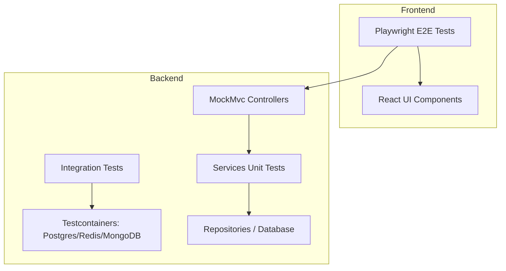

# Hướng Dẫn Kiểm Thử (Testing Guide) - HRMPro

Tài liệu này cung cấp cái nhìn toàn diện về cấu trúc kiểm thử, cách thức vận hành và hướng dẫn viết/chạy test suite cho dự án HRMPro ở cả hai phía Backend (Spring Boot) và Frontend (React + Playwright).

---

## 1. Kiến Trúc Kiểm Thử (Testing Architecture)

Hệ thống HRMPro áp dụng chiến lược kiểm thử đa tầng nhằm đảm bảo độ tin cậy tối đa từ logic nghiệp vụ đến trải nghiệm người dùng thực tế:



### A. Backend Testing Stack
*   **JUnit 5 (Jupiter)**: Framework nền tảng để chạy và quản lý các test cases.
*   **Mockito**: Mock và stub các dependencies để cô lập hoàn toàn logic xử lý trong Unit Test của lớp Service.
*   **AssertJ**: Cung cấp các cú pháp so sánh (assertions) trực quan, mạnh mẽ và dễ đọc (ví dụ: `assertThat(result).isNotNull().hasSize(3)`).
*   **Spring Boot Test**: Hỗ trợ tải một phần context (`@WebMvcTest`) hoặc toàn bộ application context (`@SpringBootTest`).
*   **Testcontainers**: Tự động spin up các Docker containers thật (PostgreSQL 16, Redis 7, MongoDB 6) khi chạy Integration Test, loại bỏ sự phụ thuộc vào cấu hình database cục bộ hoặc in-memory database không tương thích đầy đủ tính năng (như H2).
*   **JaCoCo**: Công cụ đo lường độ bao phủ mã nguồn (Code Coverage). Ngưỡng kiểm tra tối thiểu được cấu hình là **70%**.

### B. Frontend Testing Stack
*   **Playwright**: Công cụ kiểm thử E2E hiện đại, chạy các kịch bản kiểm thử trên trình duyệt thật (Chromium, Firefox, WebKit), giả lập hành vi người dùng click, điền form, chuyển trang và xác thực luồng hoạt động chính xác từ giao diện xuống database.

---

## 2. Cấu Trúc Thư Mục Kiểm Thử

```text
e:\HRMPro/
├── backend/
│   ├── pom.xml                                      # Cấu hình dependencies & JaCoCo plugin
│   └── src/test/java/com/hrmpro/
│       ├── common/                                  # Kiểm thử các thành phần dùng chung (MinIO, Exception...)
│       ├── integration/                             # Các bài kiểm thử tích hợp (Integration Tests)
│       │   ├── AbstractIntegrationTest.java         # Khởi tạo PostgreSQL, Redis, MongoDB Testcontainers
│       │   ├── AuthIntegrationTest.java             # Luồng đăng nhập, đổi mật khẩu thật
│       │   └── EmployeeIntegrationTest.java         # Vòng đời nhân viên thật qua REST API
│       ├── module/                                  # Kiểm thử Unit & Controller của từng module nghiệp vụ
│       │   ├── auth/                                # Module Xác thực (AuthServiceTest, AuthControllerTest...)
│       │   ├── employee/                            # Module Nhân sự (EmployeeServiceTest, EmployeeControllerTest...)
│       │   ├── leave/                               # Module Nghỉ phép (LeaveServiceTest, LeaveControllerTest...)
│       │   ├── attendance/                          # Module Chấm công (AttendanceServiceTest, AttendanceControllerTest...)
│       │   └── payroll/                             # Module Tính lương (PayrollServiceTest, PayrollControllerTest...)
│       └── util/
│           └── TestFixtures.java                    # Định nghĩa dữ liệu mẫu (Fixtures) tái sử dụng (DRY)
│
└── frontend/
    ├── playwright.config.ts                         # Cấu hình Playwright (browser, port, base url...)
    └── e2e/
        ├── auth.setup.ts                            # Đăng nhập toàn cục & lưu session admin để tái sử dụng
        ├── login.spec.ts                            # Test trường hợp đăng nhập & cô lập test logout
        ├── dashboard.spec.ts                        # Test thống kê & điều hướng menu
        ├── employee.spec.ts                         # Test danh sách & thêm nhân viên
        ├── leave.spec.ts                            # Test số dư phép & gửi đơn xin nghỉ
        └── attendance.spec.ts                       # Test chấm công vào/ra (Check In / Check Out)
```

---

## 3. Cách Thức Chạy Kiểm Thử

### 3.1. Chạy Backend Test

Trước khi chạy, hãy đảm bảo máy tính của bạn đã khởi động **Docker Desktop** (do Integration Test cần Testcontainers để chạy cơ sở dữ liệu ảo).

```bash
# 1. Di chuyển vào thư mục backend
cd backend

# 2. Chạy toàn bộ Unit & Integration tests
./mvnw test -Dspring.profiles.active=test

# 3. Chạy test và xuất báo cáo độ phủ JaCoCo
./mvnw verify -Dspring.profiles.active=test
```

> **Báo cáo JaCoCo HTML** sẽ được lưu tại: `backend/target/site/jacoco/index.html`. Bạn có thể mở file này bằng bất kỳ trình duyệt nào để xem chi tiết độ bao phủ của từng class, phương thức hoặc dòng code.

### 3.2. Chạy Frontend Playwright Test

Đảm bảo backend và frontend dev server đang hoạt động (hoặc Playwright sẽ tự động khởi động server thông qua thiết lập `webServer` trong config).

```bash
# 1. Di chuyển vào thư mục frontend
cd frontend

# 2. Thực thi toàn bộ các kịch bản kiểm thử E2E
npx playwright test

# 3. Xem báo cáo giao diện trực quan của Playwright
npx playwright show-report
```

---

## 4. Các Mẹo Thiết Kế & Giải Quyết Lỗi Kiểm Thử Thực Tế

### A. Tránh Xung Đột Trạng Thái Đăng Nhập (Playwright Session Conflict)
*   **Vấn đề**: Playwright sử dụng `auth.setup.ts` để đăng nhập một lần bằng tài khoản Admin và lưu trạng thái vào file `admin.json`. Các spec khác sẽ tự động sử dụng file này để bỏ qua bước đăng nhập nhằm tăng tốc độ test. Tuy nhiên, nếu một test case thực hiện thao tác **Đăng xuất (Logout)**, token admin sẽ bị hệ thống đưa vào Blacklist trên Redis, khiến toàn bộ các test cases chạy song song khác bị lỗi `401 Unauthorized`.
*   **Giải pháp**: Sử dụng thiết lập cô lập vùng nhớ cho mô tả đăng xuất:
    ```typescript
    test.describe('Đăng xuất', () => {
      // Override storageState để không sử dụng cookie admin.json toàn cục
      test.use({ storageState: { cookies: [], origins: [] } });
      
      test('đăng xuất thành công', async ({ page }) => {
        // Thực hiện đăng nhập thủ công bằng tài khoản phụ
        await page.goto('/login');
        await page.fill('#username', 'test_user');
        await page.fill('#password', 'password');
        await page.click('button[type="submit"]');
        
        // Tiến hành bấm nút đăng xuất và xác minh chuyển hướng về trang /login
        await page.click('#logout-btn');
        await expect(page).toHaveURL('/login');
      });
    });
    ```

### B. Khắc Phục Lỗi `UnnecessaryStubbingException` trong Mockito
*   **Vấn đề**: Mockito mặc định ở phiên bản mới sẽ ném exception nếu bạn mock một hành vi (`when(...).thenReturn(...)`) nhưng trong luồng chạy thực tế của phương thức kiểm thử, hành vi đó không bao giờ được kích hoạt (ví dụ: tiến trình bị lỗi đột ngột trước khi chạm tới dòng code đó).
*   **Giải pháp**: Chỉ stub những phương thức thực sự được thực thi. Nếu viết test case kiểm thử ngoại lệ (Exception), hãy phân tích kỹ luồng xử lý và gỡ bỏ các stubbing nằm sau dòng ném ngoại lệ.

---

## 5. Hướng Dẫn Viết Thêm Kiểm Thử Mới

### 5.1. Viết một Unit Test mới ở Backend
Khi bạn tạo một service mới (ví dụ: `BonusService.java`), hãy tạo file test tương ứng tại `src/test/java/com/hrmpro/module/bonus/service/BonusServiceTest.java`:

```java
@ExtendWith(MockitoExtension.class)
class BonusServiceTest {

    @Mock
    private BonusRepository bonusRepository;

    @InjectMocks
    private BonusService bonusService;

    @Test
    void calculateBonus_Success() {
        // 1. Arrange (Chuẩn bị dữ liệu và Mock hành vi)
        Bonus bonus = new Bonus();
        bonus.setAmount(BigDecimal.valueOf(1000));
        when(bonusRepository.save(any(Bonus.class))).thenReturn(bonus);

        // 2. Act (Thực thi phương thức nghiệp vụ)
        BonusResponse response = bonusService.createBonus(new BonusRequest(BigDecimal.valueOf(1000)));

        // 3. Assert (Xác minh kết quả)
        assertThat(response).isNotNull();
        assertThat(response.getAmount()).isEqualByComparingTo("1000");
        verify(bonusRepository, times(1)).save(any(Bonus.class));
    }
}
```

### 5.2. Viết một E2E Test mới bằng Playwright
Tạo một file test mới tại `frontend/e2e/bonus.spec.ts`:

```typescript
import { test, expect } from '@playwright/test';

test.describe('Quản lý Khen thưởng', () => {
  test('Tạo mới quyết định khen thưởng thành công', async ({ page }) => {
    // 1. Truy cập trang nghiệp vụ
    await page.goto('/dashboard/bonus');

    // 2. Tương tác với UI
    await page.click('button:has-text("Thêm khen thưởng")');
    await page.fill('#bonus-amount', '5000000');
    await page.fill('#reason', 'Hoàn thành xuất sắc dự án HRMPro');
    await page.click('button[type="submit"]');

    // 3. Xác thực kết quả hiển thị trên UI
    await expect(page.locator('text=Tạo khen thưởng thành công')).toBeVisible();
    await expect(page.locator('table')).toContainText('Hoàn thành xuất sắc dự án HRMPro');
  });
});
```

---

## 6. Khuyến Nghị Cho Môi Trường Production & CI/CD

1.  **Thiết lập Ngưỡng Chặn JaCoCo (Quality Gate)**:
    Cấu hình trong `pom.xml` của bạn để ngăn chặn việc build ứng dụng nếu độ phủ code bị giảm xuống dưới ngưỡng mong muốn:
    ```xml
    <rule>
        <element>BUNDLE</element>
        <limits>
            <limit>
                <counter>LINE</counter>
                <value>COVEREDRATIO</value>
                <minimum>0.70</minimum> <!-- Ngăn chặn build nếu dưới 70% -->
            </limit>
        </limits>
    </rule>
    ```
2.  **Chạy Test Headless trên CI**:
    Trong script CI/CD, luôn chạy Playwright ở chế độ `headless` để tiết kiệm tài nguyên hệ thống:
    ```bash
    npx playwright test --headed=false
    ```
3.  **Tự động dọn dẹp cơ sở dữ liệu của Testcontainers**:
    Sử dụng `@DirtiesContext` hoặc cơ chế rollback transaction để đảm bảo dữ liệu chạy thử của các Integration Test không bị nhiễm chéo qua nhau.
