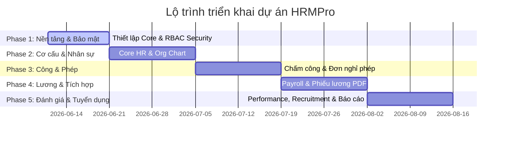

# Kế hoạch triển khai hệ thống HRMPro theo các Giai đoạn (Phases)

Tài liệu này trình bày kế hoạch triển khai chi tiết cho hệ thống quản lý nhân sự HRMPro, được chia thành **5 Phase (Giai đoạn)** phát triển rõ ràng. Mỗi Phase tập trung vào các nhóm tính năng cụ thể, có mục tiêu, đầu ra (Deliverables) và tiêu chí nghiệm thu rõ ràng nhằm đảm bảo tiến độ và chất lượng dự án.

---

## Ma trận phân quyền tổng hợp (RBAC Matrix)

Dưới đây là ma trận quyền tổng hợp làm cơ sở để phân quyền trên toàn bộ các Phase nghiệp vụ:

| Phân hệ (Module) | SUPER_ADMIN | HR_ADMIN | HR_STAFF | MANAGER | EMPLOYEE | RECRUITER |
| :--- | :--- | :--- | :--- | :--- | :--- | :--- |
| **Employee** | **Toàn** | **Toàn** | **Sửa** | **Team** | **Bản thân** | **—** |
| **Attendance** | **Toàn** | **Toàn** | **Nhập** | **Team** | **Bản thân** | **—** |
| **Leave** | **Toàn** | **Toàn** | **Xem** | **Duyệt** | **Tạo đơn** | **—** |
| **Payroll** | **Config** | **Toàn** | **—** | **—** | **Phiếu** | **—** |
| **Performance** | **—** | **Toàn** | **Xem** | **Đánh giá** | **Tự đánh** | **—** |
| **Recruitment** | **—** | **Xem** | **—** | **P.vấn** | **—** | **Toàn** |
| **Org / Dept** | **Toàn** | **Toàn** | **Xem** | **Xem** | **Xem** | **Xem** |
| **Reports** | **Hệ thống** | **Toàn** | **Giới hạn** | **Team** | **—** | **Tuyển** |

---

## Chi tiết các Giai đoạn triển khai (Phases)

---

### PHASE 1: Cơ sở hạ tầng, Xác thực & Phân quyền (Base Core & RBAC Infrastructure)
*   **Mục tiêu**: Thiết lập nền tảng bảo mật vững chắc, xác định rõ biên giới quyền truy cập API và giao diện cho cả 6 vai trò.
*   **Thời gian dự kiến**: 10 ngày.

#### 1. Các đầu việc chính:
*   **Backend (Spring Boot)**:
    *   Tối ưu hóa cơ chế xác thực JWT, cơ chế Refresh Token lưu trong Redis.
    *   Cấu hình Spring Security Method Security (`@EnableMethodSecurity`).
    *   Tạo Custom Expression Evaluator (`@hrmSecurity.isSelf()`, `@hrmSecurity.isManagerOf()`) để phân quyền dữ liệu theo dòng (Row-level security).
    *   Xây dựng API quản lý tài khoản người dùng (tạo mới, khóa/mở khóa, reset mật khẩu) của `SUPER_ADMIN`.
    *   Xây dựng module **Audit Log** để tự động lưu lịch sử thao tác của các user (ai, làm gì, lúc nào, IP nào).
*   **Frontend (ReactJS)**:
    *   Hoàn thiện luồng đăng nhập, đổi mật khẩu.
    *   Tạo `<RoleProtectedRoute>` chặn truy cập URL trái phép.
    *   Xây dựng Sidebar Navigation động, tự động ẩn/hiện các menu dựa trên quyền trả về của User.
    *   Thiết kế giao diện lỗi `403 Unauthorized` và `404 Not Found`.

#### 2. Kết quả đầu ra (Deliverables):
*   Hệ thống Auth (Login/Logout/Refresh Token) hoạt động mượt mà.
*   Giao diện Sidebar thay đổi chính xác tương ứng khi đăng nhập bằng 6 tài khoản test khác nhau (`superadmin`, `hradmin`, `hrstaff`, `manager`, `employee`, `recruiter`).
*   Bảng Audit log trong DB ghi nhận đầy đủ log hoạt động của các user.

---

### PHASE 2: Cơ cấu tổ chức & Hồ sơ nhân viên (Org Chart & Employee Life-cycle)
*   **Mục tiêu**: Xây dựng kho dữ liệu nhân sự gốc, quản lý toàn bộ vòng đời của nhân viên từ lúc onboarding đến khi thôi việc.
*   **Thời gian dự kiến**: 14 ngày.

#### 1. Các đầu việc chính:
*   **Backend (Spring Boot)**:
    *   Phát triển API phòng ban (Department) hỗ trợ cấu trúc cây phân cấp (cha - con) và bổ nhiệm quản lý phòng ban.
    *   Phát triển API chức danh (Position) và Job Grade.
    *   Phát triển API nhân viên (Employee): cập nhật hồ sơ, quản lý thông tin hợp đồng (Contract) và tình trạng nhân viên (`ACTIVE`, `PROBATION`, `TERMINATED`).
    *   Tích hợp dịch vụ S3/MinIO để upload ảnh đại diện và file PDF hợp đồng lao động.
    *   Xây dựng quy trình tự động hóa Onboarding Checklist cho nhân viên mới.
*   **Frontend (ReactJS)**:
    *   Trang xem Sơ đồ tổ chức (Org Chart) dưới dạng sơ đồ hình cây tương tác.
    *   Trang quản lý danh sách và chi tiết hồ sơ nhân viên dành cho HR (chỉ `HR_ADMIN` được thêm/xóa/terminate, `HR_STAFF` được sửa thông tin cơ bản).
    *   Trang tự phục vụ nhân viên (Employee Self-Service) để nhân viên tự cập nhật thông tin cá nhân (chờ HR duyệt).
    *   Giao diện quản lý hợp đồng lao động, hiển thị cảnh báo hợp đồng sắp hết hạn.

#### 2. Kết quả đầu ra (Deliverables):
*   Sơ đồ tổ chức (Org Chart) hiển thị trực quan cấu trúc phòng ban toàn công ty.
*   Hồ sơ nhân viên được lưu trữ đầy đủ kèm tệp tin đính kèm từ MinIO.
*   Quy trình Onboarding/Offboarding hoạt động tuần tự trên hệ thống.

---

### PHASE 3: Quản lý Chấm công & Nghỉ phép (Attendance & Leave Management)
*   **Mục tiêu**: Quản lý thời gian làm việc thực tế của nhân sự, xử lý các đơn từ phép trực tuyến để tự động hóa dữ liệu công cuối tháng.
*   **Thời gian dự kiến**: 14 ngày.

#### 1. Các đầu việc chính:
*   **Backend (Spring Boot)**:
    *   Xây dựng API check-in/out tự động ghi nhận vị trí (Location GPS) và địa chỉ IP mạng.
    *   Xây dựng service import dữ liệu chấm công từ file Excel xuất ra từ các máy chấm công.
    *   Xây dựng API đề xuất sửa công (quên chấm công, đi công tác) và cơ chế duyệt của Manager.
    *   Xây dựng API tính toán số dư ngày phép tự động hàng năm và quy trình xin nghỉ phép (Leave Request).
*   **Frontend (ReactJS)**:
    *   Nút Check-in/out nhanh trên Dashboard kèm thông tin IP/Địa điểm cho Employee.
    *   Bảng chấm công cá nhân theo tháng hiển thị chi tiết (đi trễ, về sớm, nghỉ phép).
    *   Giao diện nộp đơn xin nghỉ phép (chọn loại phép, ngày nghỉ, lý do, đính kèm minh chứng y tế).
    *   Giao diện duyệt đơn nghỉ phép của Manager: Lịch làm việc/nghỉ phép của team (Team Calendar) để tránh trùng lịch nghỉ, nút Duyệt/Từ chối.
    *   Trang điều chỉnh bảng công toàn công ty của HR.

#### 2. Kết quả đầu ra (Deliverables):
*   Nhân viên tự chấm công và gửi đơn xin nghỉ trực tuyến thành công.
*   Manager xem được lịch nghỉ của team và click duyệt đơn nghỉ trực quan.
*   Dữ liệu công được tổng hợp chính xác làm đầu vào cho bảng tính lương.

---

### PHASE 4: Tính lương, Phụ cấp & Phiếu lương (Payroll & Benefits Calculation)
*   **Mục tiêu**: Tự động hóa quá trình tính toán lương cuối tháng dựa trên dữ liệu công thực tế và cấu hình bảo hiểm, thuế TNCN.
*   **Thời gian dự kiến**: 14 ngày.

#### 1. Các đầu việc chính:
*   **Backend (Spring Boot)**:
    *   Thiết lập bảng cấu hình lương gốc (Lương tối thiểu vùng, tỷ lệ đóng bảo hiểm BHXH/BHYT/BHTN, định mức thuế thu nhập cá nhân TNCN) của `SUPER_ADMIN`.
    *   Xây dựng công thức chạy lương tự động (Payroll Run) hàng tháng:
        *   `Gross Salary = Base Salary (từ hợp đồng) * (Actual Work Days / Standard Work Days) + Allowances (Phụ cấp)`
        *   `Insurance = Gross Salary * Tỷ lệ bảo hiểm`
        *   `Taxable Income = Gross Salary - Insurance - Giảm trừ gia cảnh`
        *   `Net Salary = Gross Salary - Insurance - PIT (Thuế TNCN) - Khấu trừ khác`
    *   Xây dựng service tạo file PDF phiếu lương tự động và tải lên MinIO.
*   **Frontend (ReactJS)**:
    *   Trang cấu hình các thông số thuế và bảo hiểm dành cho `SUPER_ADMIN`.
    *   Trang chạy lương hàng tháng dành cho `HR_ADMIN`:
        *   Nút "Khởi tạo kỳ lương" (Chọn tháng, năm).
        *   Xem bảng lương tổng hợp dự thảo (Draft), chỉnh sửa thủ công các khoản thưởng/phạt.
        *   Nút "Phê duyệt & Publish" để gửi phiếu lương cho nhân viên.
        *   Nút "Xuất file ngân hàng" (Excel) theo cấu trúc định dạng ngân hàng đối tác.
    *   Trang xem và tải PDF phiếu lương (Payslip) cá nhân cho Employee.

#### 2. Kết quả đầu ra (Deliverables):
*   Bảng lương tổng hợp được tính toán tự động chính xác từng đồng.
*   Xuất được file ngân hàng để chuyển khoản lương hàng loạt.
*   Phiếu lương PDF hiển thị đẹp mắt, bảo mật bằng đường dẫn giới hạn thời gian (Presigned URL).

---

### PHASE 5: Hiệu suất, Tuyển dụng & Báo cáo nâng cao (Performance, Recruitment & HR Analytics)
*   **Mục tiêu**: Đánh giá hiệu suất nhân viên, quản lý quy trình tuyển chọn nhân sự mới và xây dựng hệ thống báo cáo quản trị tổng quan.
*   **Thời gian dự kiến**: 14 ngày.

#### 1. Các đầu việc chính:
*   **Backend (Spring Boot)**:
    *   API Đánh giá hiệu suất: Tạo chu kỳ đánh giá, thiết lập KPI cho từng nhân viên, ghi nhận điểm tự đánh giá và điểm Manager đánh giá.
    *   API Tuyển dụng: Quản lý tin tuyển dụng (Job Posting), quản lý pipeline ứng viên (Application), lên lịch phỏng vấn và gửi email mời phỏng vấn tự động qua SMTP.
    *   API Báo cáo tổng hợp: viết các câu lệnh SQL tối ưu (tránh N+1) để thống kê headcount, tỷ lệ biến động nhân sự, chi phí lương phòng ban.
*   **Frontend (ReactJS)**:
    *   Trang đánh giá hiệu suất: Form tự đánh giá cho nhân viên, Form đánh giá cho Manager.
    *   Trang Tuyển dụng của Recruiter:
        *   Kanban Board quản lý trạng thái ứng viên (Mới → Sàng lọc CV → Phỏng vấn V1 → Phỏng vấn V2 → Offer → Nhận việc).
        *   Lịch phỏng vấn trực quan và form gửi feedback của interviewer.
    *   Trang Báo cáo & Dashboard phân tích trực quan sử dụng các thư viện biểu đồ (như Recharts):
        *   `SUPER_ADMIN`: Xem audit log hệ thống, health check tài nguyên.
        *   `HR_ADMIN`: Dashboard headcount, chi phí lương, tỷ lệ turnover.
        *   `MANAGER`: Dashboard chấm công và nghỉ phép của team.
        *   `RECRUITER`: Dashboard hiệu quả tuyển dụng (time-to-hire, funnel ứng viên).

#### 2. Kết quả đầu ra (Deliverables):
*   Hệ thống đánh giá hiệu suất hoàn chỉnh có sự tương tác giữa Nhân viên - Quản lý - Nhân sự.
*   Kanban board kéo thả ứng viên tuyển dụng mượt mà, email tự động gửi đúng tiến độ.
*   Dashboard báo cáo sinh động, tải nhanh nhờ tối ưu hóa truy vấn SQL và cache Redis.

---

## Tiêu chí Nghiệm thu tổng thể (UAT & Go-Live Criteria)

1.  **Chính xác về quyền (Security Audit)**: Chạy thử kịch bản thâm nhập trái phép API từ các tài khoản có role thấp hơn, hệ thống phải trả về lỗi `403 Forbidden` ở mức API backend và không hiển thị phần tử trên UI frontend.
2.  **Độ chính xác số liệu (Financial Integrity)**: Phép tính toán lương, thuế TNCN và bảo hiểm bắt buộc phải khớp chính xác tuyệt đối với bảng Excel đối chiếu của kế toán.
3.  **Hiệu năng tải trang (Performance SLA)**:
    *   Thời gian phản hồi API trung bình dưới 200ms.
    *   Tải trang Dashboard dưới 1.5 giây.
    *   Import file 1,000 dòng chấm công dưới 5 giây.
4.  **Khả năng khôi phục (Disaster Recovery)**: Đã cấu hình sao lưu DB tự động hàng ngày lên S3, tiến hành test restore dữ liệu thành công trong dưới 15 phút.

---

## Câu hỏi mở dành cho Người dùng (Open Questions)

> [!IMPORTANT]
> Người dùng vui lòng làm rõ các câu hỏi sau để chúng tôi tinh chỉnh kế hoạch triển khai tốt nhất:
> 
> 1. **Thứ tự ưu tiên các Phase**: Bạn có muốn điều chỉnh thứ tự ưu tiên hoặc gộp/tách giai đoạn nào không?
> 2. **Dữ liệu ban đầu (Data Migration)**: Ở Phase 2 (Hồ sơ nhân viên), bạn đã có file dữ liệu nhân viên cũ dưới dạng Excel để chúng tôi viết tool import tự động ngay từ đầu không?
> 3. **Quy trình đánh giá KPI**: Quy trình đánh giá hiệu suất ở Phase 5 sẽ tính điểm theo thang điểm nào (ví dụ: A, B, C, D hay thang điểm 1-5)? Điểm số này có liên kết công thức tự động để tăng lương/thưởng ở phân hệ Lương không?
